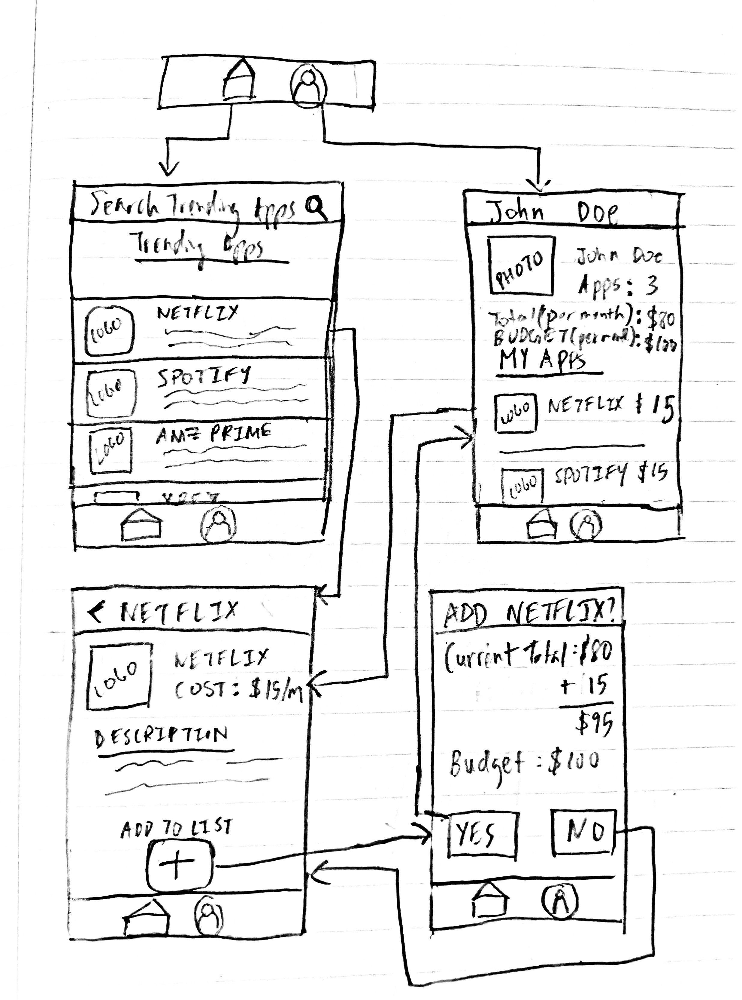

Original App Design Project - README Template
===

# AppTrackr

## Table of Contents
1. [Overview](#Overview)
1. [Product Spec](#Product-Spec)
1. [Wireframes](#Wireframes)
2. [Schema](#Schema)

## Overview
### Description
Tracks the amount of paid subscribed apps a user has and sends lets the user set a monthly budget and informs the user when the amount is over that budget. Could potentially be used to track more than just apps, e.g groceries, gas, daily expenses etc. Additionally, companies could acquire more customers from this app if the user decides to download it.(like another app store) 

### App Evaluation
[Evaluation of your app across the following attributes]
- **Category:** Daily Utilities/Self-Improvement 
- **Mobile:** This is app is mainly for mobile use becuase its made for quick info and decisions. However, it can be developed for computer as well. 
- **Story:** Analyzes the amount of apps and total subscription fees by a user. User can add subscriptions they currently use. 
- **Market:** Anyone who feels unorganized or stressed out with their expenses. 
- **Habit:** This app can be used whenever a user decides that they need to know their monthly expenses or would like to make changes from these expenses.
- **Scope:** At first, it can be used for paid apps for each user, but can eventually branch into other expenses the user has. 

## Product Spec

### 1. User Stories (Required and Optional)

**Required Must-have Stories**

* User can register a new account 
* User can login
* User can see a stream of trending apps and can add it to their subscribed list 
* User can add a new subscribed app that they want to track 
* User can set a budget per month 
* User can see all subscribed apps in the display
* User can see the detail/description for each app they subscribed to (when they click on the subscribed app)

**Optional Nice-to-have Stories**

* User can see use calender app to remind when budget per month is exceeded 
* User can add something other than subscribed apps such as daily expenses (groceries, gas, etc...)

### 2. Screen Archetypes

* Login
   * User can login
* Register
   * User can register a new account 
* Detail 
    * User can see the detail/description for each app they subscribed to
* Profile 
    * User can see all subscribed apps in the display
    * User can set a budget per month 
* Creation
    * User can add a new subscribed app + add the subscription per month for that app that they want to track 
* Stream 
    * User can see a stream of trending apps and can add it to their subscribed list 

### 3. Navigation

**Tab Navigation** (Tab to Screen)

* Stream
* Create
* Profile 

**Flow Navigation** (Screen to Screen)

* Login - User logs into their account 
    * Stream
* Register - User signs up into their account
    * Stream
* Detail 
* Profile 
    * Detail
* Creation
    * Stream
* Stream - User can see trending apps in a list 
    * Detail

## Wireframes

### [BONUS] Digital Wireframes & Mockups

### [BONUS] Interactive Prototype

## Schema 
[This section will be completed in Unit 9]
### Models
[Add table of models]
### Networking
- [Add list of network requests by screen ]
- [Create basic snippets for each Parse network request]
- [OPTIONAL: List endpoints if using existing API such as Yelp]
